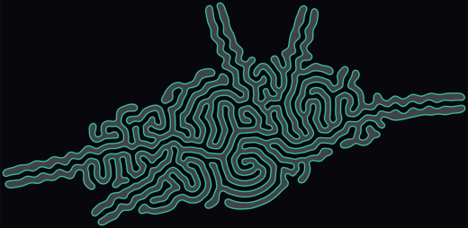

# Differential growth — live

An interactive version of the differential growth algorithm: a closed or open chain of
nodes that pushes itself apart, pulls itself together, and grows by splitting its own
edges until it fills the space available. It began as a batch Python script that took
minutes per image; this runs a step per frame with every parameter live.

| file | what it is |
|---|---|
| `growth-core.js` | the algorithm and the render styles. The only copy of either. |
| `index.html` | the interactive version. Open it directly — no server, no build. |
| `presets.js` | the thirteen examples below, as complete configurations |
| `growth.js` | the command line version: `node growth.js --help` |
| `make-examples.js` | re-renders `examples/` from `presets.js` |

Both front ends load `growth-core.js`, so there is no second implementation to drift out
of step.

---

## The thirteen presets

Each is a complete configuration — seeds, forces, constraints and drawing — and each is
in the Presets menu. The pictures were rendered from those same definitions by
`node make-examples.js`.

### Starting from a primitive

| | |
|---|---|
|  | **Coral** — one circle, left to fill the plane. The original script's look: black fill, red outline. Everything below is a departure from this. |
|  | **Neon** — dialled in by hand in the app and saved out as a settings file, used here verbatim. Weak attraction against heavy repulsion with the damping right down, so the curve settles slowly and wanders instead of packing radially: a labyrinth rather than a disc. |
|  | **Lobes** — a repulsion radius half again as wide, longer edges, and stopped early. Fat arms with room between them instead of a filled disc. Same algorithm, four different numbers. |
|  | **Strand** — an open seed. With two loose ends instead of a ring it meanders rather than closing into a blob, and the fill turns itself off, since filling an open path just closes it across the ends. |

### Combining shapes

| | |
|---|---|
|  | **Twins** — two circles placed apart. Each grows as its own curve: they never join, but they repel each other, so they compete for the middle ground and meet along a seam. Any number of seeds can share a canvas. |
|  | **Corral** — a drawn boundary pens the growth in and two obstacles stand in its way. The walls push back like a line of nodes, so the curve holds the same distance from them that it holds from itself, and the run ends when the boundary is full rather than when the node budget runs out. |

### Render styles

| | |
|---|---|
|  | **Graphite** — the same kind of outline drawn as hundreds of short overlapping strokes, each taking its own length, width and opacity from a range. |
|  | **Scribble** — wide ranges, long strokes that mostly ignore the curve, four passes. The same geometry, drawn loose. |
|  | **Grain** — the stipple style: the outline read as dots rather than a line, each taking its own size and opacity, scattered a little off the true edge. |
|  | **Topography** — the contour style: the outline echoed outward and inward in fading steps, so the form reads like a map. |

### Keeping the history

| | |
|---|---|
|  | **Rings** — stacking. Every few steps is left in the picture rather than erased, so the whole evolution of the outline shows at once, like growth rings. The form is the same as Coral's; what you are looking at is its history. Fade is up, so the oldest layers sit back. |
|  | **Sediment** — the same thing with nothing fading. Every layer carries the same weight, so the record thickens evenly and the first outline reads as clearly as the last. |
|  | **Ember** — two concentric rings, and every stroke nudged around the colour wheel and up or down in value, so the line burns unevenly. |

---

## The algorithm

Per step, as in the original script:

1. **Attraction** — each node pulls toward its two path neighbours, once the edge is
   longer than `min-edge`.
2. **Repulsion** — every node pushes away from all nodes inside `repulsion-radius`,
   falling off linearly to zero at the radius.
3. **Noise** — a small random kick.
4. **Alignment** — each node is pulled toward the midpoint of its neighbours.
5. **Integration** — velocity accumulates with `damping` and is consumed on each move,
   exactly as the original's `add_force` / `update_position` did.
6. **Growth** — any edge longer than `max-edge` gets a jittered midpoint node.

Rendering uses the same collinear-tangent cubic Bézier construction the original script
used, so the on-screen curve matches the exported SVG.

The repulsion loop is the one performance change: the original compared every pair, this
uses a uniform grid and visits each close pair once. About 9 ms/step at 4 000 nodes,
where the original took minutes to get there.

Several curves share one node array, each holding a contiguous range. Attraction,
alignment, smoothing and splitting work within a curve; repulsion and the barriers work
across all of them. That is what lets two seeds push on each other while staying separate
outlines. A single seed is bit-identical to before multi-curve support existed, verified
against stored digests.

---

## Using it

### Seeds

The **Seed shape** menu holds the primitives (circle — the original's distorted circle —
plus ring, star, square, and an open line), anything you have traced, and *Draw closed…*
/ *Draw open…*.

Choosing any of them puts the shape on the canvas provisionally, and a bar over the
canvas asks what to do with it: **Add** puts it alongside what is already growing,
**Replace** makes it the only seed, **Cancel** leaves things as they were. Tracing works
the same way, with Add and Replace live once the line is long enough.

The panel then reads as the menu, the pills for what is currently seeded, and **X, Y,
Rotate, Scale** for whichever pill is selected. You can drag a seed on the canvas too,
from inside it or by its outline. Seeds show as blue outlines while nothing has grown,
the selected one solid, and disappear once growth starts. Scale and rotation work about
each shape's own centre. A traced outline keeps the position and size you drew it at.

**Clear** (next to Auto-fit) empties the canvas — nothing grows until a shape is chosen.

### Constraints

*Draw boundary…* pens the growth inside an area it cannot leave; *Draw obstacle…* marks
an area it has to flow around, and you can add as many as you like. Both are kept where
you draw them.

**Wall repel** decides how they behave. At 1 a wall's edge is sampled into points spaced
like the curve's own nodes and pushes back with the same force law, so the growth holds
the same gap from a wall as from its own folds — measured 39–42 units against a 44–50
unit fold gap. At 0 the wall is only a hard stop and the curve presses flat against it.
A hard clearance sits underneath either way, so nothing can cross.

**Show constraints** (Appearance, or `C`) hides the dashed guides so you see the form on
its own. They are never included in an export.

### Forces

Every force parameter is live — drag a slider mid-growth and the form responds.
**Repulsion radius** sets the gap between folds, **Min/Max edge** the strand thickness
and when an edge splits. **Speed** goes below 1 step per frame; growth saturates in about
50 steps, so at full rate it is over in under a second.

### Appearance

Everything visual is in one section, under Draw / Colour / Line / Sketch headings, with
the **Style** menu on its header so it is reachable while the section is folded.

- **Smooth** — the Bézier outline, fill and stroke.
- **Stipple** — dots along the outline: spacing, size, scatter and opacity, the last
  three as ranges.
- **Contour** — the outline echoed outward and inward: how many, how far apart, and how
  fast they fade.
- **Pencil sketch** — hundreds of short overlapping strokes. **Length**, **Follow
  curve**, **Wander**, **Width ×**, **Opacity**, **Hue ±**, **Saturation ±** and
  **Value ±** are two-handled sliders: each stroke takes its own value from between the
  handles, which is what makes the line read as hand-made. Collapse a range and every
  stroke matches, giving a mechanical line; open Follow curve wide and some strokes cut
  straight across the curve while others trace it. Value is what varies a black sketch,
  where hue and saturation have nothing to work with.

**Hue ±**, **Saturation ±** and **Value ±** are shared by every style that makes marks,
so stipple and contour vary their colour the same way.

A style measures in **output pixels**, not world units — it is handed how much world one
pixel covers. So a sketch keeps the same character whether you are zoomed out on a
4 000-node form or exporting at 4 000 px, exactly as a real pen does not get finer
because the subject got bigger.

**Keep every frame** (Appearance → Stacking) stops clearing the canvas: each frame is
kept and the next drawn over it, so the evolution piles up into one image. **Stack every**
sets the steps between layers — low values lay down a dense blur, high ones leave distinct
outlines — and **Fade** lets the oldest layers sink back toward the paper.

The stack lives in screen pixels, so the view has to hold still while it fills: turning
it on switches auto-fit off, and panning or zooming starts a clean sheet. Frame the shape
for its finished size first, then reset and let it grow into that frame. PNG export writes
the stack at canvas resolution rather than the usual 2000 px.

**Auto-fit** (toolbar, or `F`) is a toggle: on, the view keeps the whole form in frame;
turning it on re-frames straight away, and panning or zooming turns it off. With it off,
Reset leaves your view alone.

Reset always holds paused, so a fresh seed can be looked at before it runs. Which panel
sections you leave folded is remembered between visits.

`space` play · `R` reset · `S` step · `F` auto-fit · `C` constraints · `Tab` panel ·
scroll zoom · drag pan · hold `B` (or shift) and drag to push the curve.

### Saving and export

- **Save current…** keeps a named copy in browser storage; chip to load, × to delete.
- **Copy link** puts the whole configuration in a URL — the way to move a form to
  another machine.
- **To file / Load from file** writes it as JSON. Prefer this for traced outlines, which
  make long links.
- **SVG** and **PNG** export the artwork; constraints and guides are never included.
- **Copy node command** writes the `growth.js` invocation for exactly what is on screen
  — seeds with their placement, traced outlines, constraints, style and all its ranges.

View state (pan, zoom) is deliberately not saved: the same settings should reproduce the
same growth, not the same camera.

---

## Adding a render style

Add an entry to `STYLES` in `growth-core.js`:

```js
myStyle: {
  label: 'My style',
  params: ['someParam'],            // rows tagged style:'myStyle' in index.html
  render(sink, sim, P, unit){       // unit = world units per output pixel
    sink.begin();
    sink.moveTo(x, y); sink.lineTo(x, y); sink.quadTo(cx, cy, x, y);
    sink.stroke(P.stroke, P.strokeWidth * unit, 0.8);
  },
},
```

Styles draw into a *sink* rather than onto a canvas, so one implementation serves the
live canvas, the PNG export and the SVG export in both the browser and the CLI. A new
style appears in the menu, exports, and works from the CLI as `--style myStyle` with no
further wiring. `arcTable(sim, range)` gives arc-length lookup along a curve if a style
wants to walk it rather than follow nodes.

---

## What was fixed along the way

**Scalloped edges.** Two causes, found by measuring node offset from the neighbours'
midpoint over mean edge length. First, running past the node budget: splitting edges is
the only outlet these forces have, and once it is shut off the curve keeps compressing —
mean edge 10.9 → 19 → 1e84 → NaN, degrading into scallops on the way. The run now stops
at the budget and says so, and a node may never move further than one max edge per step.
Second, nodes one or two apart along the path repelling each other, which forces excess
length into the shortest wavelength available. Measured wobble before → after: Brain
0.43 → 0.15, Coral 0.34 → 0.15, Strand 0.24 → 0.13.

Two controls address the second cause. **Strand smoothing** is a Taubin λ/μ low-pass —
plain Laplacian smoothing shrinks the curve and shrinkage eats the length growth feeds
on, so the negative pass puts the low frequencies back. **Skip path neighbours** exempts
nearby nodes from repulsion, but that repulsion is also part of what *drives* growth, so
the value is capped automatically at what the repulsion radius can afford. Set both to 0
for the original behaviour, scalloping included.

**Bézier hooks.** Sharp kinks rendered as curled hooks that were not in the node data.
The control arm now fades as the tangent turns away from its chord.

**Seed subdivision.** A 10-gon at radius 125 has ~78-unit edges, far above min-edge, so
it contracted instead of growing. The seed is now subdivided to the working edge length
first — an earlier version of the original script sized its seed the same way.

**Barrier tunnelling.** With a boundary in play, per-step motion could exceed the
clearance margin and jump the wall, after which the node was too far out to recover.
Steps are capped below the margin, and a node found on the wrong side is pulled back
whatever its distance. Zero escapes across boundary-only, boundary-plus-obstacles and
obstacles-only runs.

The run stops itself, with a reason, on four conditions: node budget, boundary filled,
growth stalled (nothing split for 150 steps), and numerical instability.
