# Differential growth — live

An interactive version of the differential growth algorithm: a closed or open chain of
nodes that pushes itself apart, pulls itself together, and grows by splitting its own
edges until it fills the space available. It began as a batch Python script that took
minutes per image; this runs a step per frame with every parameter live.

| file | what it is |
|---|---|
| `growth-core.js` | the algorithm and the render styles. The only copy of either. |
| `index.html` | the interactive version. Open it directly — no server, no build. |
| `presets.js` | the fifteen examples below, as complete configurations |
| `growth.js` | the command line version: `node growth.js --help` |
| `make-examples.js` | re-renders `examples/` from `presets.js` |

Both front ends load `growth-core.js`, so there is no second implementation to drift out
of step.

---

## The presets

Each is a whole picture — seeds, forces, constraints, drawing and whether the view
follows — and selecting one applies every setting, including the ones it does not
mention, which come from the defaults rather than from whatever was loaded before. They
fall into two kinds.

### Growth and shape

What the simulation itself can do. All six wear the same black body and red edge, so the
only thing differing between them is the form, and any walls are left visible.

| | |
|---|---|
| 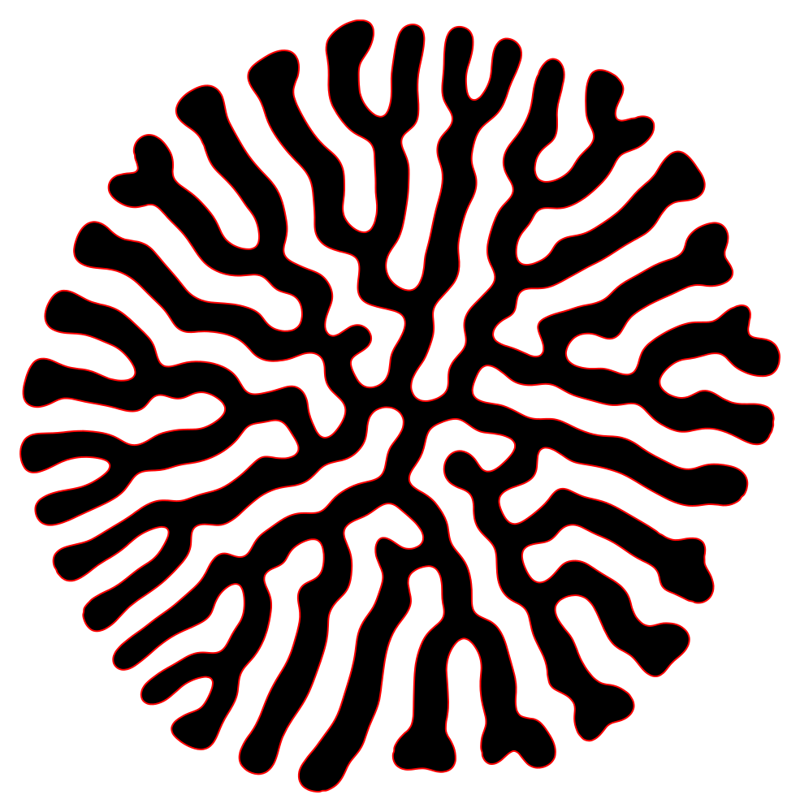 | **Coral** — one circle, left to fill the plane. The baseline the rest depart from. |
| 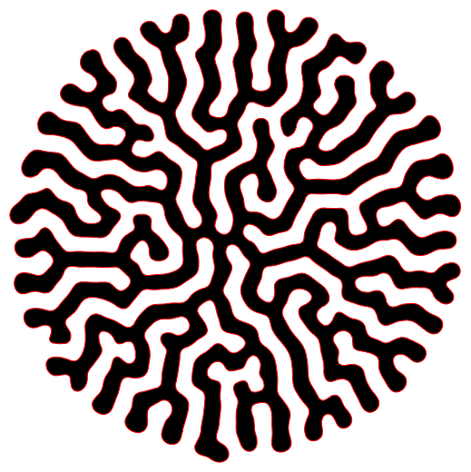 | **Rosette** — the Coral again at the same budget, with the repulsion radius cut by a third and the edges shortened to match. The radius sets the gap the folds keep from one another, so the same three thousand nodes buy many more and finer arms: they radiate from the centre, forking as they go, and fill a disc with a clean rim rather than sprawling into a few fat lobes. Stopped at the budget, which is what keeps the rim sharp. |
| 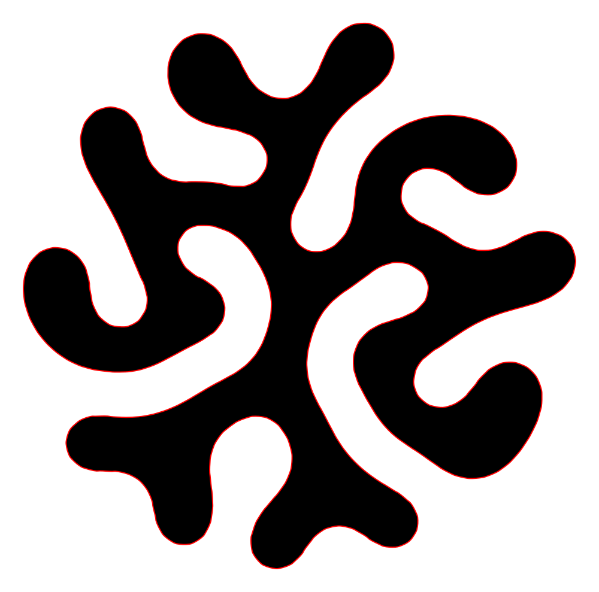 | **Lobes** — a repulsion radius half again as wide, longer edges, and a budget of six hundred: fat arms with room between them instead of a filled disc. With the pause off, the budget goes in a hundred steps and the next nine hundred are spent pushing those arms apart into an even splay. |
| 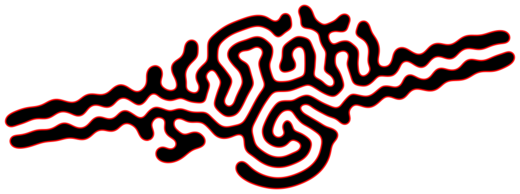 | **Meander** — weak attraction against heavy repulsion with the damping right down. The curve settles slowly and wanders into a labyrinth instead of packing radially. It runs at five steps a frame, since at one it barely moves, and holds a still frame sized for where it ends up: it spreads nearly three times as wide as it is tall. |
| 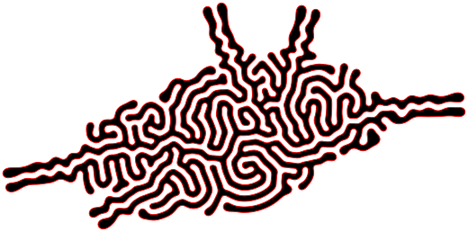 | **Sprawl** — the Meander forces with the budget more than trebled and *Pause when the budget is reached* switched off. Growth still stops at the last node, but the run does not: the curve keeps relaxing into the room it has left and ends only when the settle test says it has stopped moving. It spends the budget at step 9,290 and settles at 12,004, packing the plane far denser than the Meander ever gets. |
| 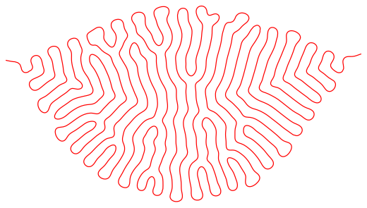 | **Strand** — an open seed has two ends, so it meanders rather than closing into a blob. With no inside to fill, only the edge is drawn. |
| 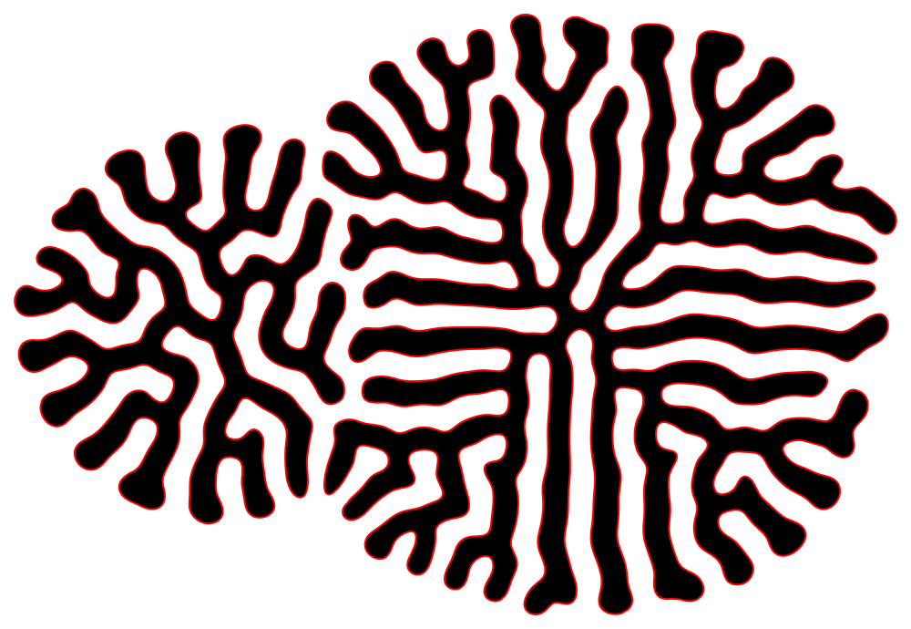 | **Twins** — a circle and a square four times its size, set well apart, both starting from sixteen corner points. They grow as separate curves that never join, but each pushes the other back where they meet, and the smaller one comes off worse. |
| 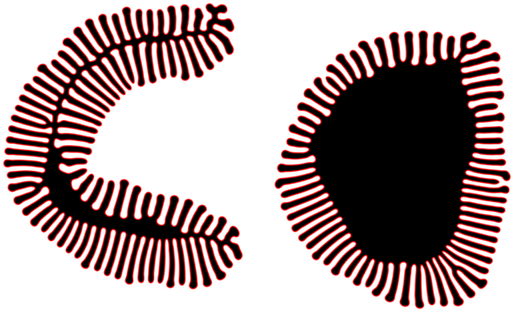 | **Tracings** — two outlines drawn by hand and set side by side. A traced seed keeps the place and size it was drawn at, so the pair grows exactly where it was put, each pressing on the other where they meet. The pause at the budget is off: the ten thousand nodes go in seventy-eight steps, and the five hundred after them are what combs the fringes out and settles the line between the two. |
| 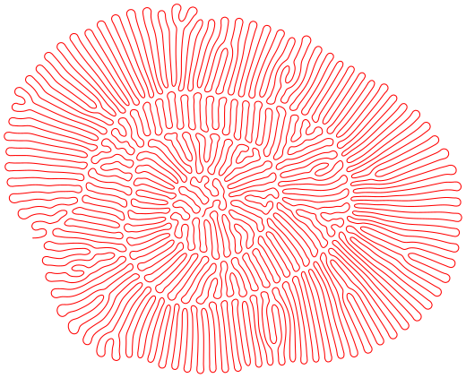 | **Snail** — a spiral traced by hand in one open line and grown to twenty thousand nodes. An open strand has two ends and no inside, so rather than filling a body it folds back on itself until it has packed the area out, and the turns of the original spiral still read as bands across the finished sheet. |
| 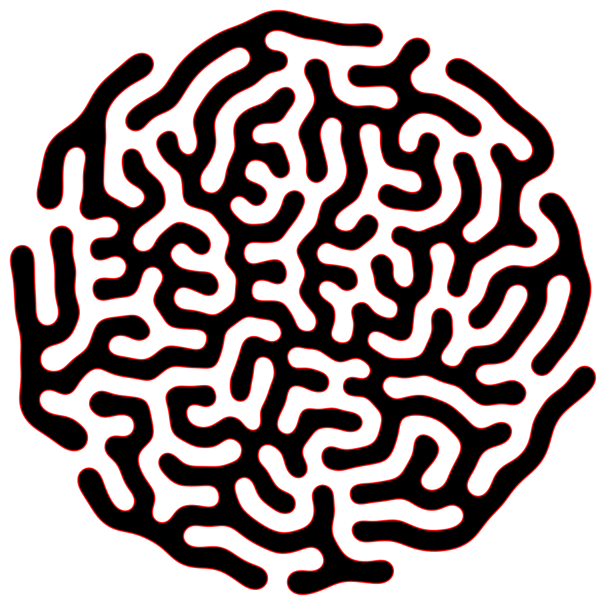 | **Warren** — edges a third the usual length, nothing skipped in the repulsion, and heavy smoothing. Every node feels every neighbour, so the folding is as fine and as even as the tool gets: a round mass packed with passages of one width throughout, with none of the radial arms the coarser settings throw out. The budget goes in thirty-five steps and twelve hundred more go into working the folds even. |
| 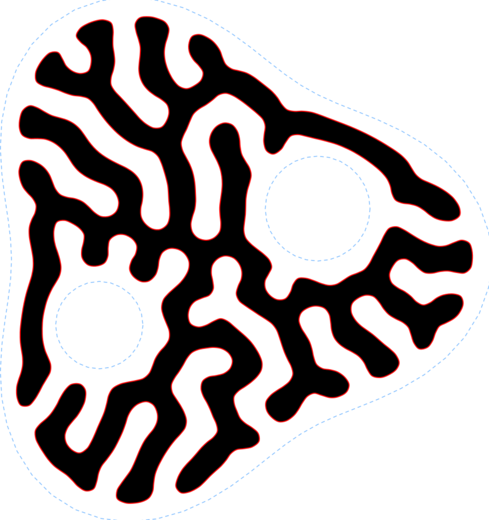 | **Corral** — a drawn boundary pens the growth in and two obstacles stand in its way. The walls are shown dashed, as they are in the app. |

### Applications

Whole pictures, where the drawing is as much the point as the shape.

| | |
|---|---|
| 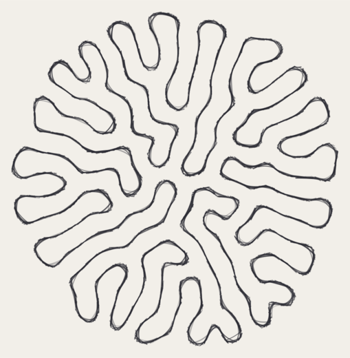 | **Graphite** — the pencil style: the outline as hundreds of short strokes, each taking its own length, width and opacity from a range. |
| 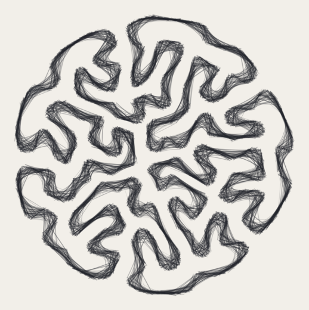 | **Scribble** — wide ranges and long strokes that mostly ignore the curve, four passes of loose hatching. |
| 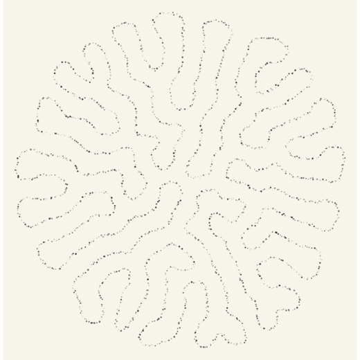 | **Grain** — the stipple style at close spacing with the dots thrown well off the line, stacked as it grows: the outline reads as a drifting grain rather than an edge. Dialled in by hand and saved out of the app. |
| 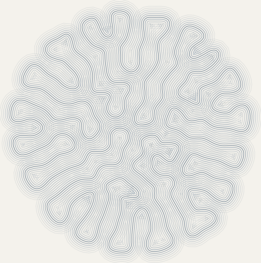 | **Topography** — the contour style: nine echoes at close spacing, each stepped round the colour wheel, so the form reads as banded ground rather than a line. Dialled in by hand and saved out of the app. |
| 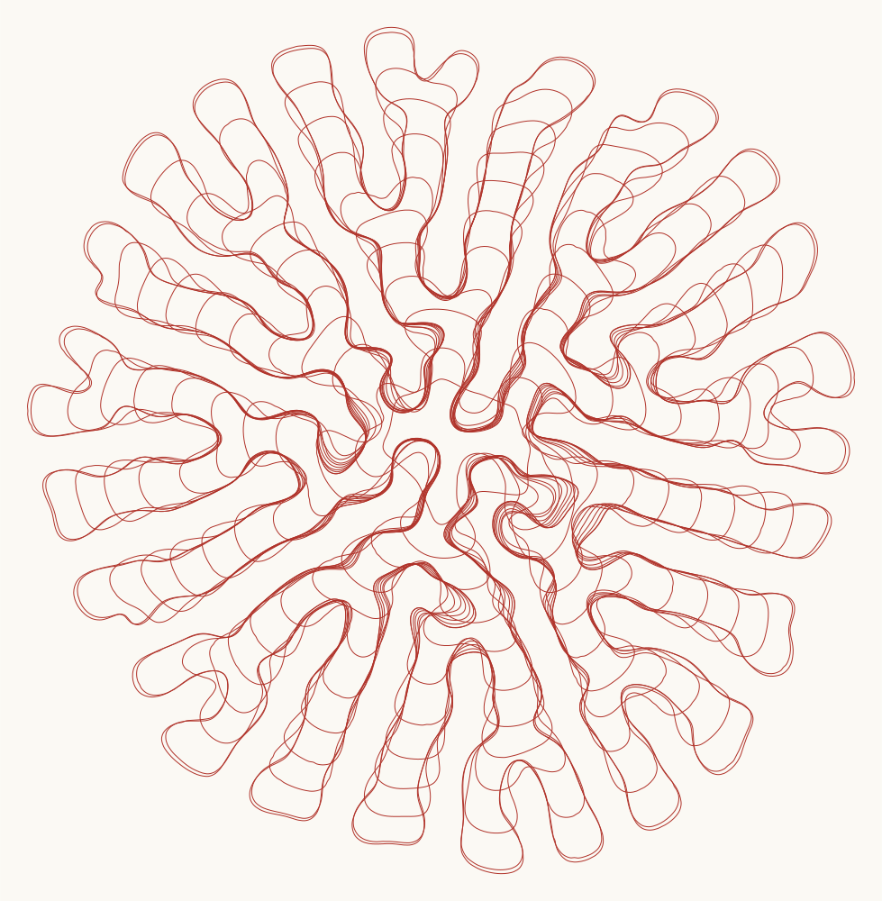 | **Rings** — stacking, with the oldest layers sinking back. Auto-fit is off in this one, because the layers only line up if the view holds still. |
| 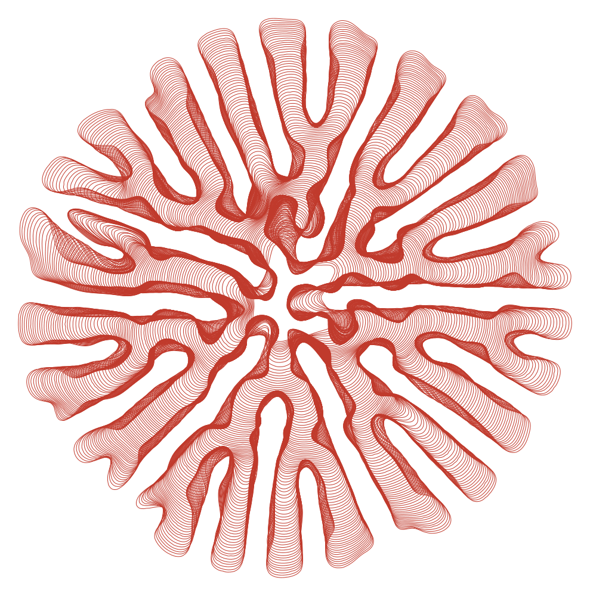 | **Sediment** — the same with nothing fading: every layer carries the same weight, so the record thickens evenly. Auto-fit off as well. |
| 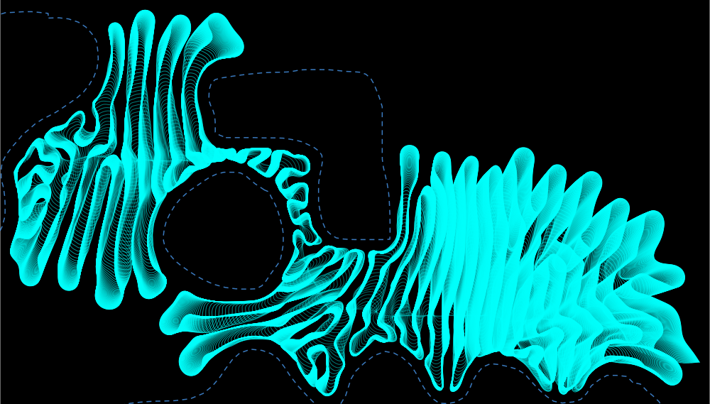 | **Neon rabbit** — a strand traced by hand, set loose among four drawn obstacles and stacked every step. It threads the gaps between them in cyan, and the record of where it has been fills the space they leave. The pause at the budget is off, so it carries on past its last node until the settle test calls it done. Auto-fit off, framed for where it ends up. |
| 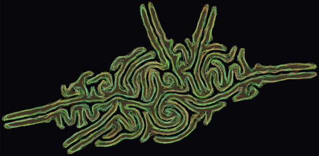 | **Verdigris** — the Meander forces again, but with the body filled in dark olive under mint strokes whose hue swings right round toward amber. The labyrinth reads as a corroded, speckled surface rather than a line. |
| 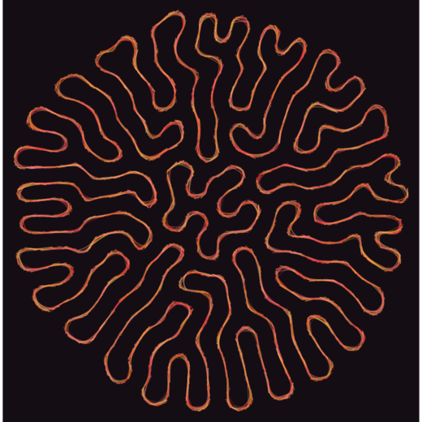 | **Ember** — two concentric rings, every stroke nudged around the colour wheel and up or down in value, so the line burns unevenly. |

The pictures are rendered from those definitions by `node make-examples.js`.

---

## The algorithm

Per step, as in the original script:

1. **Attraction** — each node pulls toward its two path neighbours, once the edge is
   longer than `min-edge`.
2. **Repulsion** — every node pushes away from all nodes inside `repulsion-radius`,
   falling off linearly to zero at the radius.
3. **Noise** — a small random kick.
4. **Alignment** — each node is pulled toward the midpoint of its neighbours.
5. **Integration** — velocity accumulates with `damping` and is consumed on each move,
   exactly as the original's `add_force` / `update_position` did.
6. **Growth** — any edge longer than `max-edge` gets a jittered midpoint node.

Rendering uses the same collinear-tangent cubic Bézier construction the original script
used, so the on-screen curve matches the exported SVG.

The repulsion loop is the one performance change: the original compared every pair, this
uses a uniform grid and visits each close pair once. About 9 ms/step at 4 000 nodes,
where the original took minutes to get there.

Several curves share one node array, each holding a contiguous range. Attraction,
alignment, smoothing and splitting work within a curve; repulsion and the barriers work
across all of them. That is what lets two seeds push on each other while staying separate
outlines. A single seed is bit-identical to before multi-curve support existed, verified
against stored digests.

---

## Using it

### Seeds

The **Seed shape** menu holds the primitives (circle — the original's distorted circle —
plus ring, star, square, and an open line), anything you have traced, and *Draw closed…*
/ *Draw open…* / *Import SVG…*.

Choosing any of them puts the shape on the canvas provisionally, and a bar over the
canvas asks what to do with it: **Add** puts it alongside what is already growing,
**Replace** makes it the only seed, **Cancel** leaves things as they were. Tracing works
the same way, with Add and Replace live once the line is long enough.

**Import SVG…** reads a file and turns every shape in it into a traced outline. It walks
each shape with `getPointAtLength` rather than parsing path commands, so paths, polygons,
rectangles, circles and the rest all work and their transforms come along; a path that
closes itself becomes a closed seed and one that does not stays open. The file is scaled
and centred as a unit so its parts stay in register, and an import arrives on the same
bar, so cancelling drops all of it. `samples/elephant.svg` is there to try it on.

Growth is expansion, so a detailed silhouette used as a *seed* swells out of recognition
within a hundred steps — the elephant is a coral by step eighty. Import it as a boundary
instead if you want the shape itself to survive.

The panel then reads as the menu, the pills for what is currently seeded, and **X, Y,
Rotate, Scale** for whichever pill is selected. You can drag a seed on the canvas too,
from inside it or by its outline. Seeds show as blue outlines while nothing has grown,
the selected one solid, and disappear once growth starts. Scale and rotation work about
each shape's own centre. A traced outline keeps the position and size you drew it at.

**Clear** (next to Auto-fit) empties the canvas — nothing grows until a shape is chosen.

### Constraints

*Draw boundary…* pens the growth inside an area it cannot leave; *Draw obstacle…* marks
an area it has to flow around, and you can add as many as you like. Both are kept where
you draw them.

**Wall repel** decides how they behave. At 1 a wall's edge is sampled into points spaced
like the curve's own nodes and pushes back with the same force law, so the growth holds
the same gap from a wall as from its own folds — measured 39–42 units against a 44–50
unit fold gap. At 0 the wall is only a hard stop and the curve presses flat against it.
A hard clearance sits underneath either way, so nothing can cross.

**Show constraints** (Appearance, or `C`) hides the dashed guides so you see the form on
its own. They are never included in an export.

### Forces

Every force parameter is live — drag a slider mid-growth and the form responds.
**Repulsion radius** sets the gap between folds, **Min/Max edge** the strand thickness
and when an edge splits. **Speed** goes below 1 step per frame; growth saturates in about
50 steps, so at full rate it is over in under a second.

### Appearance

Everything visual is in one section, under Draw / Colour / Line / Sketch headings, with
the **Style** menu on its header so it is reachable while the section is folded.

- **Smooth** — the Bézier outline, fill and stroke.
- **Stipple** — dots along the outline: spacing, size, scatter and opacity, the last
  three as ranges. **Scatter power** sets how the dots fall across that scatter rather
  than how wide it is. At 5 they are spread evenly through the band, which is a cloud
  with no line left in it. At 1 their density thins out in a straight line with distance,
  so the edge still reads through the haze. Below 1 they pack in tight against the
  outline and it comes back as a line with a little fuzz on it.
- **Contour** — the outline echoed outward and inward: how many, how far apart, and how
  fast they fade.
- **Pencil sketch** — hundreds of short overlapping strokes. **Length**, **Follow
  curve**, **Wander**, **Width ×**, **Opacity**, **Hue ±**, **Saturation ±** and
  **Value ±** are two-handled sliders: each stroke takes its own value from between the
  handles, which is what makes the line read as hand-made. Collapse a range and every
  stroke matches, giving a mechanical line; open Follow curve wide and some strokes cut
  straight across the curve while others trace it. Value is what varies a black sketch,
  where hue and saturation have nothing to work with.

**Hue ±**, **Saturation ±** and **Value ±** are shared by every style that makes marks,
so stipple and contour vary their colour the same way.

A style measures in **output pixels**, not world units — it is handed how much world one
pixel covers. So a sketch keeps the same character whether you are zoomed out on a
4 000-node form or exporting at 4 000 px, exactly as a real pen does not get finer
because the subject got bigger.

**Keep every frame** (Appearance → Stacking) stops clearing the canvas: each frame is
kept and the next drawn over it, so the evolution piles up into one image. **Stack every**
sets the steps between layers — low values lay down a dense blur, high ones leave distinct
outlines — and **Fade** lets the oldest layers sink back toward the paper.

The stack lives in screen pixels, so the view has to hold still while it fills: turning
it on switches auto-fit off, and panning or zooming starts a clean sheet. Frame the shape
for its finished size first, then reset and let it grow into that frame. PNG export writes
the stack at canvas resolution rather than the usual 2000 px.

**Auto-fit** (toolbar, or `F`) is a toggle: on, the view keeps the whole form in frame;
turning it on re-frames straight away, and panning or zooming turns it off. With it off,
Reset leaves your view alone.

Reset always holds paused, so a fresh seed can be looked at before it runs. Which panel
sections you leave folded is remembered between visits.

`space` play · `R` reset · `S` step · `F` auto-fit · `C` constraints · `Tab` panel ·
scroll zoom · drag pan · hold `B` (or shift) and drag to push the curve.

### Saving and export

- **Save current…** keeps a named copy in browser storage; chip to load, × to delete.
- **Copy link** puts the whole configuration in a URL — the way to move a form to
  another machine.
- **To file / Load from file** writes it as JSON. Prefer this for traced outlines, which
  make long links.
- **SVG** and **PNG** export the artwork; constraints and guides are never included.
- **Copy node command** writes the `growth.js` invocation for exactly what is on screen
  — seeds with their placement, traced outlines, constraints, style and all its ranges.

View state is saved only when auto-fit is off, because at that point the framing is a
choice you made rather than something the app picked. It is stored as the world rectangle to
frame — centre and half-extents — so it lands the same whatever size the window is, and a
form wider than it is tall is framed on both counts rather than left small in the middle.

Four presets rely on this. The two stacking ones must, since their layers only line up if
the view holds still. Meander and Neon do because following them would rescale the window constantly
as they sprawl. All three arrive framed for the size the shape finishes at, and
grow into the picture rather than off the edge of it.

---

## Adding a render style

Add an entry to `STYLES` in `growth-core.js`:

```js
myStyle: {
  label: 'My style',
  params: ['someParam'],            // rows tagged style:'myStyle' in index.html
  render(sink, sim, P, unit){       // unit = world units per output pixel
    sink.begin();
    sink.moveTo(x, y); sink.lineTo(x, y); sink.quadTo(cx, cy, x, y);
    sink.stroke(P.stroke, P.strokeWidth * unit, 0.8);
  },
},
```

Styles draw into a *sink* rather than onto a canvas, so one implementation serves the
live canvas, the PNG export and the SVG export in both the browser and the CLI. A new
style appears in the menu, exports, and works from the CLI as `--style myStyle` with no
further wiring. `arcTable(sim, range)` gives arc-length lookup along a curve if a style
wants to walk it rather than follow nodes.

---

## What was fixed along the way

**Scalloped edges.** Two causes, found by measuring node offset from the neighbours'
midpoint over mean edge length. First, running past the node budget: splitting edges is
the only outlet these forces have, and once it is shut off the curve keeps compressing —
mean edge 10.9 → 19 → 1e84 → NaN, degrading into scallops on the way. The run now stops
at the budget and says so, and a node may never move further than one max edge per step.
Second, nodes one or two apart along the path repelling each other, which forces excess
length into the shortest wavelength available. Measured wobble before → after: Brain
0.43 → 0.15, Coral 0.34 → 0.15, Strand 0.24 → 0.13.

Two controls address the second cause. **Strand smoothing** is a Taubin λ/μ low-pass —
plain Laplacian smoothing shrinks the curve and shrinkage eats the length growth feeds
on, so the negative pass puts the low frequencies back. **Skip path neighbours** exempts
nearby nodes from repulsion, but that repulsion is also part of what *drives* growth, so
the value is capped automatically at what the repulsion radius can afford. Set both to 0
for the original behaviour, scalloping included.

**Bézier hooks.** Sharp kinks rendered as curled hooks that were not in the node data.
The control arm now fades as the tangent turns away from its chord.

**Seed subdivision.** A 10-gon at radius 125 has ~78-unit edges, far above min-edge, so
it contracted instead of growing. The seed is now subdivided to the working edge length
first — an earlier version of the original script sized its seed the same way.

**Barrier tunnelling.** With a boundary in play, per-step motion could exceed the
clearance margin and jump the wall, after which the node was too far out to recover.
Steps are capped below the margin, and a node found on the wrong side is pulled back
whatever its distance. Zero escapes across boundary-only, boundary-plus-obstacles and
obstacles-only runs.

## When a run stops

Two conditions end a run, and the HUD reports which.

**The node budget** is reached. Splitting edges is the only outlet these forces have, so
once it is shut off the curve keeps compressing and the outline degrades; the run stops
there rather than spoiling what it made. Turn off **Pause when the budget is reached**
and only the growth stops: the form carries on relaxing into whatever room it has left,
until the settle test ends it. Sprawl and Neon rabbit both work that way.

**The shape settles** — it is no longer getting anywhere. Measured as the change in the
outline's total length over the last hundred steps, as a fraction, shown live in the HUD
next to the node count, and stopped once it stays under **Settle at** for sixty steps.

Length over a window, rather than movement between two frames, because neither simpler
measure works. Raw movement says nothing: a heavily damped run creeps at a hundredth the
speed of a lively one while growing perfectly well, so any threshold on speed calls it
finished immediately. Per-step length change says nothing either: a slow configuration
adds a ten-thousandth of its length per step while filling, which is indistinguishable
from zero. Over a hundred steps the difference between creeping and finished is plain —
Corral settles at 0.0001 once its boundary is full, while Meander is still reading 0.07
after fifteen hundred steps and is left to carry on.

An unbounded form never settles, since it can always spread further; those end at the
budget. A walled one ends when it has filled its walls.

The useful thresholds run over two decades, from a couple of ten-thousandths for a form
that has genuinely stopped to a few hundredths for one only creeping, so the slider is
geometric rather than linear and its bottom notch reads **off**, never stopping for this.
A tight threshold and a loose one are different pictures, not different waits: Neon rabbit
at 0.07 stops after 367 steps, and at 0.01 it runs to 954 and lays down nearly three times
the record.

Numerical instability also halts a run, though that is a fault rather than a finish.
